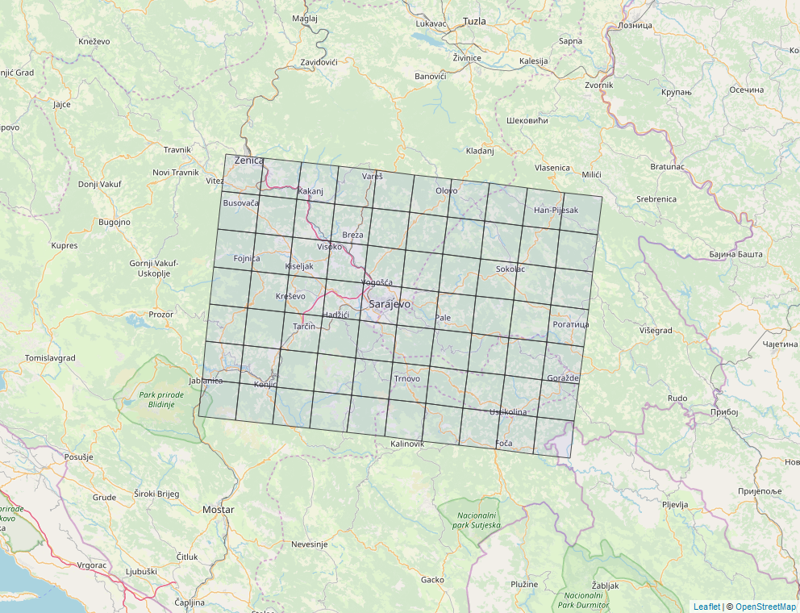

```{r setup, include=FALSE}
rm(list=ls())

library(osmdata)
library(tidyverse)
library(sf)
library(mapview)
library(knitr)
library(kableExtra)


```

Import a 2km and 10km grid file for Europe CMAQ cities. The 2km grid file has a domain name in it, but the 10km does not, so use the 2km grid to remove data from the 10km grid that we are not interested in.

```{r get_sarajevo_grids, include=F}
  
ten_km_grid   <- suppressMessages(st_read('../emep_emissions_onto_osm/cmaq_grid/cmaq_cities_10km_grids.shp')) %>% st_transform(4326)
two_km_grid   <- suppressMessages(st_read('../emep_emissions_onto_osm/cmaq_grid/CMAQ2km_47domains.shp')) %>% st_transform(4326)

domain        <- 'SARA2'

two_km_grid   <- two_km_grid[two_km_grid$domain == domain,]

ten_km_grid   <- st_crop(ten_km_grid, two_km_grid)

rm(two_km_grid)

```

End up with a file which gives a 10km grid covering the domain (`r print(domain)`) of interest.

```{r map_of_domain, include=F}
m <- mapview(ten_km_grid, map.types = 'Esri.WorldImagery', alpha.regions=0.1)
mapshot(m, file = paste0(getwd(), "/map.png"), remove_controls = c("zoomControl", "layersControl", "homeButton","scaleBar"))
```



For each grid square in the ten_km_grid (`r nrow(ten_km_grid)`) download the roads and buildings from OSM.

```{r setup_for_download, include=F}

major_roads <- c('motorway', 'motorway link', 'trunk', 'trunk link', 'primary', 'primary link', 'secondary', 'tertiary')
minor_roads <- c('residential', 'service', 'unclassified')

api_list <- c('http://overpass-api.de/api/interpreter',
              'https://lz4.overpass-api.de/api/interpreter',
              'https://z.overpass-api.de/api/interpreter',
              'https://overpass.kumi.systems/api/interpreter')

roads_to_import <- c(major_roads, minor_roads)
```

Now download the data for the domain by road type, harmonise, then join them all together into one road file.

```{r download_data, include=F}

  ## Download the roads in that square, by road type in turn
  for (j in 1:length(roads_to_import)){
    
    api_to_use <- sample(1:length(api_list), 1)
  
    set_overpass_url(api_list[api_to_use])
    
    temp_road <- opq(bbox = st_bbox(ten_km_grid)) %>%
                      add_osm_feature(key = 'highway', value= roads_to_import[j]) %>% 
                      osmdata_sp()
    
    if (nrow(temp_road$osm_lines) > 0) {
      
      temp_road <- st_as_sf(temp_road$osm_lines)
      
      ## If columns are missing, add them. Also re-order and change to charaters where needed
      if ('maxspeed' %in% names(temp_road))  {} else{temp_road$maxspeed <- NA}
      if ('lanes'    %in% names(temp_road))  {} else{temp_road$lanes    <- NA}
      if ('highway'  %in% names(temp_road))  {} else{temp_road$highway  <- as.character(roads_to_import[j])}
      if ('osm_id'   %in% names(temp_road))  {} else{temp_road$osm_id   <- as.character(row.names(temp_road))}
      
      temp_road <- temp_road[,c('osm_id', 'highway', 'lanes', 'maxspeed', 'geometry')]
      
      temp_road$highway  <- as.character(temp_road$highway)
      temp_road$lanes    <- as.character(temp_road$lanes)
      temp_road$maxspeed <- as.character(temp_road$maxspeed)
      
      ## Bind the roads to the previous roads if they exist
      if (!exists('grid_roads')) {grid_roads <- temp_road;} else {grid_roads <- rbind(grid_roads, temp_road)}
      
      rm(temp_road)
    }
    
  }


```

Join the CMAQ 10km file so we can see which cell each road is in.

```{r join_the_ten_km_grid, include=F}

grid_roads          <- st_intersection(grid_roads, ten_km_grid)

```

Of the data we have downloaded from OSM, `r nrow(grid_roads[is.na(grid_roads$lanes),])` rows have no lane data (`r nrow(grid_roads[is.na(grid_roads$lanes),])/nrow(grid_roads)`%). So we fill that in as below.

```{r add_missing_lane_data, include=F}

grid_roads[grid_roads$highway == 'primary'          & is.na(grid_roads$lanes),'lanes'] <- 2
grid_roads[grid_roads$highway == 'primary link'     & is.na(grid_roads$lanes),'lanes'] <- 2
grid_roads[grid_roads$highway == 'secondary'        & is.na(grid_roads$lanes),'lanes'] <- 2
grid_roads[grid_roads$highway == 'motorway'         & is.na(grid_roads$lanes),'lanes'] <- 3
grid_roads[grid_roads$highway == 'motorway link'    & is.na(grid_roads$lanes),'lanes'] <- 3
grid_roads[grid_roads$highway == 'trunk'            & is.na(grid_roads$lanes),'lanes'] <- 3
grid_roads[grid_roads$highway == 'trunk link'       & is.na(grid_roads$lanes),'lanes'] <- 3
grid_roads[grid_roads$highway == 'tertiary'         & is.na(grid_roads$lanes),'lanes'] <- 2
grid_roads[grid_roads$highway == 'residential'      & is.na(grid_roads$lanes),'lanes'] <- 2
grid_roads[grid_roads$highway == 'service'          & is.na(grid_roads$lanes),'lanes'] <- 2
grid_roads[grid_roads$highway == 'unclassified'     & is.na(grid_roads$lanes),'lanes'] <- 2

```

Of the data we have downloaded from OSM, `r nrow(grid_roads[is.na(grid_roads$maxspeed),])` rows have no speed limit data (`r nrow(grid_roads[is.na(grid_roads$maxspeed),])/nrow(grid_roads)`%). So we also fill that in as follows.

```{r add_missing_speed_data, include=F}

grid_roads[grid_roads$highway == 'primary'          & is.na(grid_roads$maxspeed),'maxspeed'] <- 30
grid_roads[grid_roads$highway == 'primary link'     & is.na(grid_roads$maxspeed),'maxspeed'] <- 30
grid_roads[grid_roads$highway == 'secondary'        & is.na(grid_roads$maxspeed),'maxspeed'] <- 30
grid_roads[grid_roads$highway == 'motorway'         & is.na(grid_roads$maxspeed),'maxspeed'] <- 70
grid_roads[grid_roads$highway == 'motorway link'    & is.na(grid_roads$maxspeed),'maxspeed'] <- 70
grid_roads[grid_roads$highway == 'trunk'            & is.na(grid_roads$maxspeed),'maxspeed'] <- 40
grid_roads[grid_roads$highway == 'trunk link'       & is.na(grid_roads$maxspeed),'maxspeed'] <- 40
grid_roads[grid_roads$highway == 'tertiary'         & is.na(grid_roads$maxspeed),'maxspeed'] <- 30
grid_roads[grid_roads$highway == 'residential'      & is.na(grid_roads$maxspeed),'maxspeed'] <- 30
grid_roads[grid_roads$highway == 'service'          & is.na(grid_roads$maxspeed),'maxspeed'] <- 30
grid_roads[grid_roads$highway == 'unclassified'     & is.na(grid_roads$maxspeed),'maxspeed'] <- 30

```

The final roads for the domain look like this

```{r plot_roads}
plot(st_geometry(grid_roads), col='blue')
```

And the data is in this format

```{r roads_example}
head(grid_roads) %>%
  kable() %>%
  kable_styling()
```